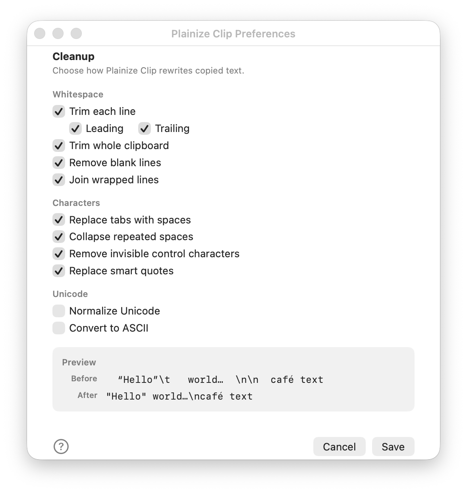

# Plainize Clip


Plainize Clip is a tiny faceless macOS utility that cleans the current text
pasteboard and quits. It is a modern Swift/AppKit/SwiftUI successor experiment
inspired by [Plain Clip][plain-clip].

The app is intentionally not a menu bar app and not a resident background app.
Normal launch performs one pasteboard cleanup pass, then terminates.
It is not a clipboard manager, and it does not run persistently in the background. Personally, I launch it through Spotlight.

## Behavior

Normal app launch:

1. Reads saved preferences from `UserDefaults`.
2. Cleans the general pasteboard if it contains plain text.
3. Writes back plain text only.
4. Quits.

Preferences:

- Hold Shift while launching, or launch with `--preferences`.
- Save persists settings and immediately runs one cleanup pass using those
  settings.
- Cancel closes without saving.



From Terminal, open the preferences window directly with:

```bash
open -a "/Applications/Plainize Clip.app" --args --preferences
```

Preference options:

- Trim each line: removes leading and/or trailing whitespace from every line.
- Trim whole clipboard: removes whitespace from the start and end of the full
  clipboard string.
- Remove blank lines: collapses repeated blank lines.
- Join wrapped lines: replaces hard line breaks between non-empty lines with a
  space, useful for copied hard-wrapped prose.
- Replace tabs with spaces: converts tab characters to plain spaces.
- Collapse repeated spaces: repeatedly reduces double spaces to one space.
- Remove invisible control characters: removes low ASCII controls except tab
  and newline, and cleans common invisible spacing characters such as zero-width
  spaces.
- Replace smart quotes: converts curly quotes, guillemets, en dashes, and em
  dashes to plain ASCII punctuation.
- Normalize Unicode: converts decomposed Unicode sequences such as `e` plus a
  combining acute accent into their precomposed form, such as `é`.
- Convert to ASCII: first romanizes non-Latin scripts best-effort, strips
  diacritics, maps common punctuation to ASCII, then filters remaining
  non-ASCII characters.

CLI wrapper:

```bash
PlainizeClip/plainize-clip [options]
```

The wrapper launches the built app binary in CLI cleaning mode. Supported
options include:

- `-t`: CLI-cleaning mode, used by the wrapper
- `-w`: trim trailing whitespace per line
- `-l`: trim leading whitespace per line
- `-i`: remove invisible/control characters
- `-r`: join hard-wrapped lines
- `-b`: remove blank lines
- `-q`: replace smart quotes and typographic dashes
- `-s`: collapse repeated spaces
- `-p`: replace tabs with spaces
- `-a`: convert to ASCII
- `-n`: normalize Unicode
- `-m`: trim the whole string

The ASCII conversion uses best-effort romanization for non-Latin scripts before
dropping unsupported characters. For example, CJK, Korean, Arabic, Hebrew, and
Cyrillic text are transliterated approximately instead of causing the clipboard
to become empty.

## Release Notes

### 0.2.0

- Added draft localizations for the preferences window across Tier 3 languages.
- Made ASCII conversion safer for non-Latin text by romanizing before filtering
  to ASCII.
- Added regression coverage for RTL, CJK, Korean, Cyrillic, and mixed-script
  pasteboard text.

## Unsigned Releases

GitHub release builds are packaged as `PlainizeClip-<version>-unsigned.zip`.
They are not Developer ID signed or notarized, so macOS may block the app the
first time you open it.

To open an unsigned build:

1. Download and unzip the release.
2. Move `Plainize Clip.app` to `/Applications`.
3. Try to open it once.
4. Open System Settings > Privacy & Security.
5. In Security, click Open Anyway for Plainize Clip.
6. Confirm that you trust the app and open it again.

Apple documents this flow in [Open a Mac app from an unknown developer][apple-open-unknown].
If macOS does not show Open Anyway and you trust the downloaded copy, remove the
quarantine flag for this app only:

```bash
xattr -dr com.apple.quarantine "/Applications/Plainize Clip.app"
```

## Project

- Product: `Plainize Clip.app`
- Bundle id: `com.mindflakes.PlainizeClip`
- Platform: macOS 13+
- UI model: `LSUIElement` faceless app with an on-demand preferences window
- Source: Swift, SwiftUI, AppKit, XCTest

## Build

```bash
xcodebuild -project PlainizeClip.xcodeproj -scheme PlainizeClip -configuration Debug build
```

The debug app appears under Xcode DerivedData as `Plainize Clip.app`.

## Test

```bash
xcodebuild -project PlainizeClip.xcodeproj -scheme PlainizeClip -configuration Debug test
```

The tests cover the argument parser, individual cleaning fixtures, and a
general pasteboard round trip.

## Source Layout

- `PlainizeClip/AppDelegate.swift`: launch routing, CLI mode, preferences flow
- `PlainizeClip/Plainizer.swift`: string cleanup pipeline
- `PlainizeClip/PlainizeOptions.swift`: defaults and persisted option keys
- `PlainizeClip/PasteboardPlainizer.swift`: pasteboard read/write integration
- `PlainizeClip/PreferencesWindowController.swift`: preferences window UI
- `PlainizeClip/plainize-clip`: shell wrapper for CLI mode
- `PlainizeClipTests/PlainizeClipTests.swift`: XCTest coverage

## Relationship To Plain Clip

Plainize Clip borrows the spirit of [Plain Clip][plain-clip] by
[Carsten Blüm][carsten-bluem]: stay invisible, do one job, and quit. Plain Clip
is no longer available from the author's current site, but the original Plain
Clip 2.5.2 ZIP is available through [Archive.org][plain-clip-archive].

Plainize Clip keeps similar cleanup options, but it is a new
Swift/AppKit/SwiftUI implementation for modern direct distribution.

## Notes

- The preferences window uses a centered titlebar label to match the classic
  Plain Clip feel while keeping the main content in SwiftUI.
- The window is fixed-size by design because the preference surface is small
  and deterministic.
- The app currently has no installer packaging.
- License: MIT.

[plain-clip]: https://www.bluem.net/en/mac/plain-clip/
[carsten-bluem]: https://www.bluem.net/
[plain-clip-archive]: https://web.archive.org/web/20250331212359/https://www.bluem.net/files/plain-clip-2.5.2.zip
[apple-open-unknown]: https://support.apple.com/guide/mac-help/open-a-mac-app-from-an-unknown-developer-mh40616/mac
